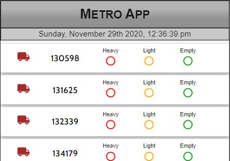
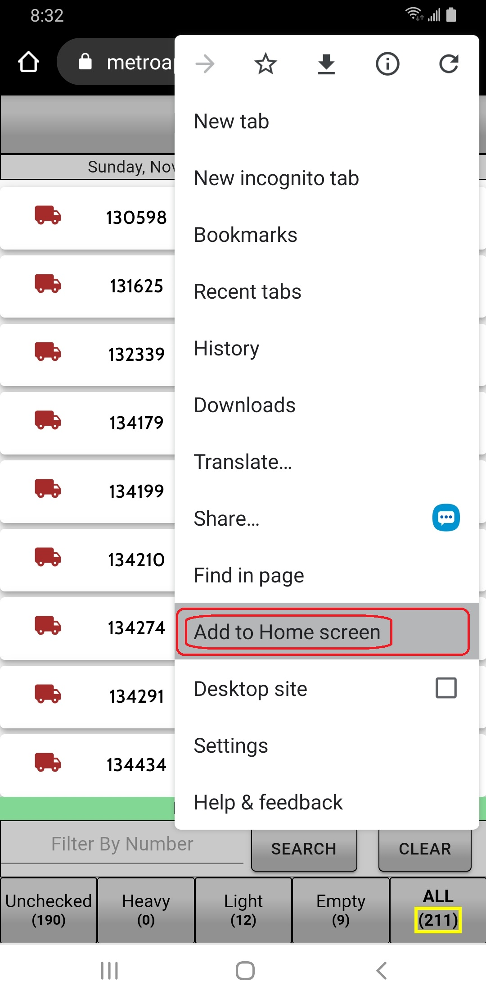
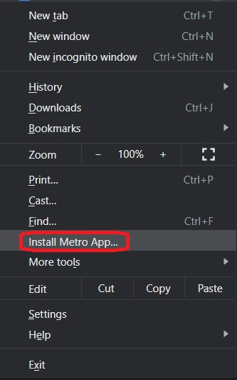
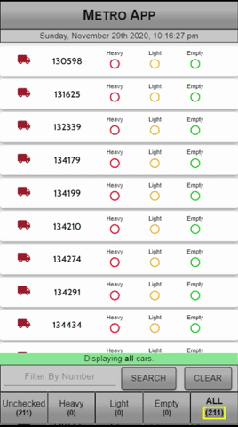
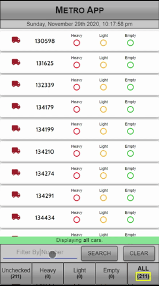
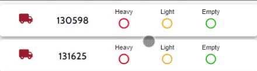
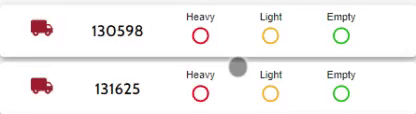
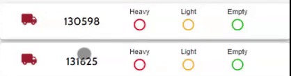
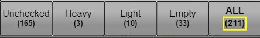

# [Metro App](https://metroappx.herokuapp.com/)
      

## Description

An application that provides UPS management teams a real-time solution to track and update the status of UPS Package cars, designed to be used by multiple members of management simultaneously.

## Installation (Mobile)

Visit the Metro App [site](https://metroappx.herokuapp.com/) on your mobile device.

Then click Add to Home Screen, either on the popup at the bottom of the screen or through your mobile devices browser menu:

## Installation (Desktop)

Visit the Metro App [site](https://metroappx.herokuapp.com/) in your desktop browser.

Then click Add to Home Screen, either on the popup at the bottom of the screen or through your mobile devices browser menu:

## Usage

To open the application click on the Metro App icon that was added to your desktop/mobile device during installation.  The application can also be used directly from the browser at [https://metroappx.herokuapp.com/](https://metroappx.herokuapp.com/)

The app displays all the package cars in your operation.  To update the status of a package car first locate the number of the package car you want to update either by scrolling to it or search by number.

## Search

The search feature displays all package cars that contain the number searched for.  

### Example 1: 
Search for car number 657929:

### Example 2: 
Search for all cars with 998 in the number:

## Select Status Heavy, Light, or Empty

Select **'Heavy' (red)** for heavy volume.  Selecting 'Heavy' indicates that the package car needs to be moved inside to unload.  

Select **Light (yellow)** for light volume.  'Light' status indicates that the package car has a small amount of volume that is able to be consolidated into another car. 

Select **'Empty' (green)** to indicate that the package car is empty and contains no volume that needs to be unloaded.  

## Volume Filters

At the bottom of the screen there are 5 filters that display the total number of Unchecked, Heavy, Light, Empty, and All cars.
Clicking on one of these buttons will display all the cars of that volume type.

Please note that Metro App will automatically update itself to display the most current package car data.  This includes the package car status updates made by other members of management.

## License

Copyright (c) 2020 Jesse Mazur

Permission is hereby granted, free of charge, to any person obtaining a copy
of this software and associated documentation files (the "Software"), to deal
in the Software without restriction, including without limitation the rights
to use, copy, modify, merge, publish, distribute, sublicense, and/or sell
copies of the Software, and to permit persons to whom the Software is
furnished to do so, subject to the following conditions:

The above copyright notice and this permission notice shall be included in all
copies or substantial portions of the Software.

THE SOFTWARE IS PROVIDED "AS IS", WITHOUT WARRANTY OF ANY KIND, EXPRESS OR
IMPLIED, INCLUDING BUT NOT LIMITED TO THE WARRANTIES OF MERCHANTABILITY,
FITNESS FOR A PARTICULAR PURPOSE AND NONINFRINGEMENT. IN NO EVENT SHALL THE
AUTHORS OR COPYRIGHT HOLDERS BE LIABLE FOR ANY CLAIM, DAMAGES OR OTHER
LIABILITY, WHETHER IN AN ACTION OF CONTRACT, TORT OR OTHERWISE, ARISING FROM,
OUT OF OR IN CONNECTION WITH THE SOFTWARE OR THE USE OR OTHER DEALINGS IN THE
SOFTWARE.

Alpha version is online: [Metro App](https://metroappx.herokuapp.com/)

